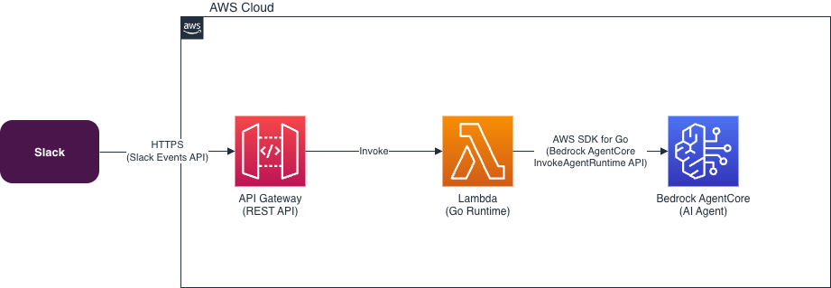

# ChatAgent

過去 LangChainGo で実装した Slack Bot（[slackbot_go](https://github.com/shirapi/slackbot_go) ※参考実装）を再構築する。
AIエージェント部分を AWS AgentCore + Strands に切り出し、Slack 側は Go で Clean Architecture により実装する。

詳細な設計は [docs/spec.md](./docs/spec.md) を参照。

## 仕様

- Botを使用できるのは特定のオープンチャンネルに限定する。
  対象外チャンネルからのメンションには定型文（`このチャンネルでは回答できません`）で応答する。
- 質問はBotにメンションして開始し、Botは発言したユーザーにメンションしてスレッドで返信する。
  メンション無しでチャンネルに投稿しただけ、スレッドに返信しただけではBotは反応しない。
  ※ Botが無条件に反応すると、チャンネル内・スレッド内でのユーザー同士のやり取りがしづらくなるため。
- 応答に時間がかかるため、処理中であることを示すためにBotは発言に対して先にリアクションをつける（リアクション名は環境変数で指定）。
- スレッドの内容についてBotは記憶がある状態で会話できる（スレッド単位で文脈を保持する）。

## 全体アーキテクチャ



```
Slack → Go (AWS Lambda) → AgentCore Runtime (AWS) → Strandsエージェント (Python)
                                  ↓
Slack ← Go (AWS Lambda) ←←←←←←←← レスポンス
```

- **Go (Lambda)**: Slackイベント受信・検証・AgentCore呼び出し・Slack返信
- **Python (AgentCore)**: キャラクター定義・Webサーチスキル

### ポイント

- 会話履歴はAgentCoreがセッション単位で管理するため、Go側での履歴取得は不要。
- SlackのスレッドタイムスタンプをそのままAgentCoreのSessionIDとして使用する。
